Dota 2 Chat Emoticons
====================

The recently added Dota 2 Chat Emoticons from the compendium stretch goal as GIF for the use on your website/forum/etc.

## Demo

### 32x32px

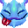
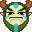
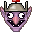
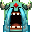
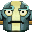

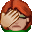
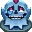

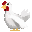
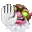
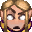
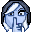

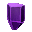
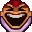
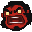
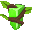
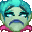
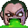
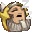

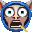
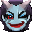

### 16x16px

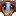
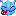
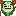
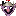
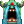
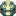
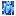
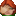
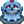

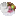
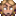

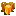

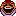
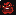
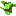
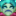
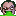

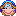
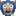
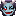

## Installation

Just copy the `assets` folder into your project and refer to the corresponding gifs in your HTML.

## Update Workflow

You will need graphicscmagick/imagemagick (`apt-get install graphicsmagick` on Debian/Ubuntu) and Ruby (get it e.g. via [rvm.io](http://rvm.io)) to run the generator.

1. Extract `scripts/emoticons.txt` from Dota 2 pak files and export to `src/scripts/emoticons.txt`
3. Extract `resource/flash3/images/emoticons` from Dota 2 pak files to `src/emoticons`
4. Run `bundle` to get the required packages for the generator
5. Run `ruby generator.rb`

### Tools

Tools I used: [Gibbeds VPK Extractor](https://developer.valvesoftware.com/wiki/Gibbeds_VPK_Extractor)

Full List of Third Party Tools: https://developer.valvesoftware.com/wiki/Category:Third_Party_Tools