Dota 2 Chat Emoticons
====================

The recently added Dota 2 Chat Emoticons from the compendium stretch goal as GIF and CSS animation for the use on your website/forum/etc.

## Demo (GIF)

### 32x32px


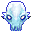

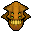
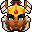

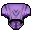
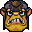
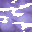
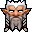


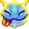
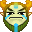
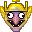
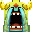
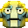
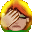
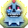
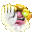
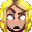

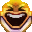
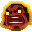
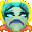
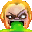
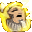
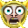
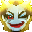
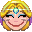
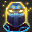
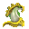
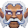
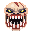
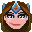
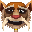
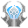
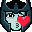
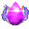
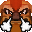
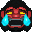
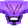
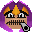
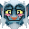

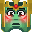
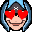
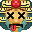
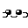


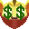
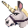
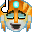

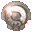
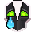
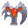
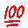


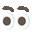


(24x24px and 16x16px variants also included)

## Installation & Usage

Just copy the `assets` folder into your project and refer to the corresponding gifs in your HTML.

To use the CSS animation version with the PNGs embed the `assets/stylesheets/dota2-chat-emoticons.css` into your HTML and use like this:

```html
<i class="d2ce wink"></i>
<i class="d2ce blush"></i>
<i class="d2ce cheeky"></i>
...
```

> **Recommendation**: For highest quality, use the CSS Animation since PNG supports alpha.

## Update Workflow

In case Valve adds more emoticons:

You will need graphicscmagick/imagemagick (`apt-get install graphicsmagick` on Debian/Ubuntu) and Ruby (get it e.g. via [rvm.io](http://rvm.io)) to run the generator.

1. Extract the emoticon source images from the VPK using a tool such as https://github.com/SteamDatabase/ValveResourceFormat.
The source image are inside `panorama/images/emoticons`.
1. Export an environment variable `EMOTICON_SRC` that points to this folder.
1. Run `bundle` to get the required packages for the generator
1. Run `ruby generator.rb`. By default, this command will not regenerate existing emoticons. Use the `--regenerate` flag if all emoticons need to be regenerated.

> **Important**: If you plan to update this README, update the file `src/README.md.eruby` since the README will be generated from it

----------------

All game images and names are property of Valve Corporation.
